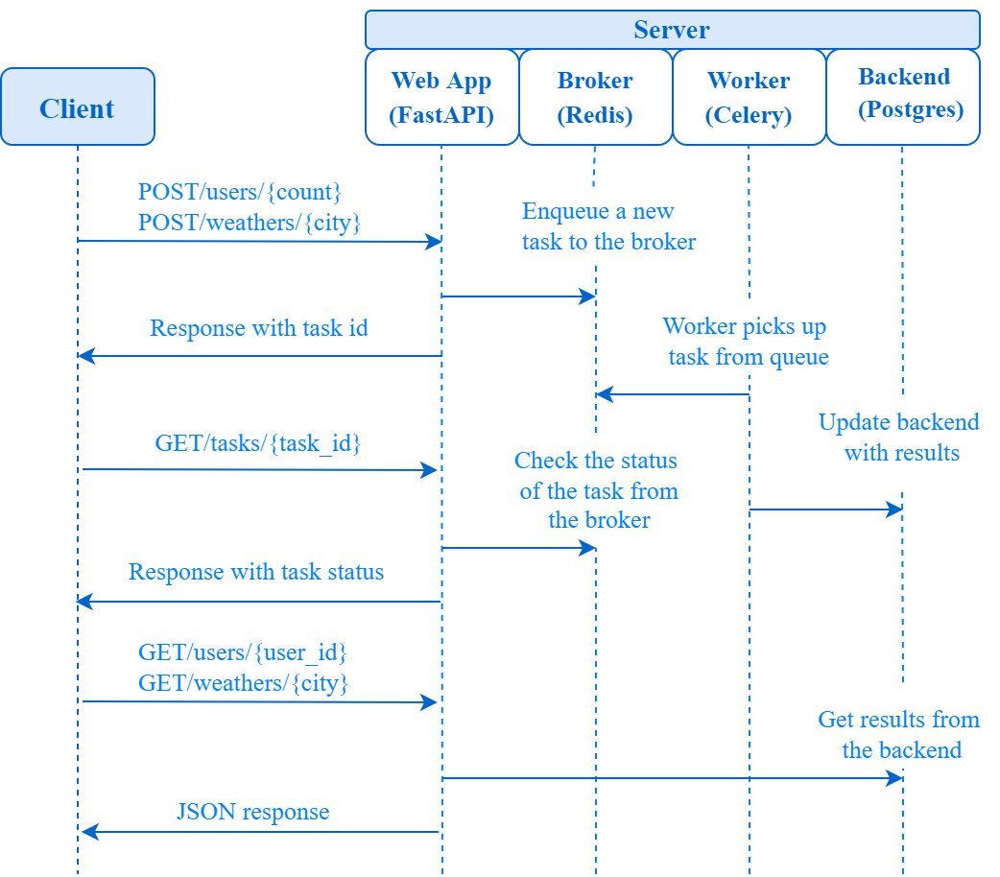

# A Study on Asynchronous REST API Testing

This project serves as the practical subject for a Final Paper, focusing on the challenges and strategies for testing asynchronous REST APIs. It explores the key differences between validating traditional synchronous endpoints and modern, non-blocking asynchronous flows that rely on background task processing.

This work uses a robust stack including **FastAPI**, **Celery** for background tasks, **Redis** as a message broker, and **PostgreSQL** for data persistence, all containerized with **Docker**.

## Original Project Acknowledgments

This project is an extension and in-depth study based on the excellent work of **Alperen Cubuk**. The original repository provides a fantastic foundation for a modern web application and can be found here:

* **Original Author:** Alperen Cubuk
* **Original Repository:** [https://github.com/alperencubuk/fastapi-celery-redis-postgres-docker-rest-api](https://github.com/alperencubuk/fastapi-celery-redis-postgres-docker-rest-api)

## Thesis Focus: Testing Asynchronous APIs

While traditional API testing focuses on immediate request-response validation (a synchronous flow), modern applications increasingly use background tasks to handle long-running or non-critical processes, improving responsiveness and user experience. However, this introduces complexity into the testing cycle.

This project, with its Celery-based background tasks, provides a perfect environment to study and demonstrate solutions for:

* **The 3-Step Testing Pattern:** Implementing and validating the **Trigger -> Poll -> Verify** pattern required for asynchronous operations.
* **Handling Asynchronicity:** Addressing challenges like managing test execution time, implementing reliable polling strategies, and avoiding flaky tests.
* **End-to-End Validation:** Ensuring that a task not only is accepted by the API but is successfully processed by the worker and results in the correct state change in the database.

## Core Technologies

* **[FastAPI](https://fastapi.tiangolo.com/)**: High-performance web framework for building APIs.
* **[Celery](http://www.celeryproject.org/)**: Distributed task queue for running background jobs.
* **[Redis](https://redis.io/)**: In-memory data store, used as the Celery message broker.
* **[PostgreSQL](https://www.postgresql.org/)**: Powerful, open-source object-relational database system.
* **[SQLAlchemy](https://www.sqlalchemy.org/)**: The Python SQL Toolkit and Object Relational Mapper.
* **[Docker](https://docs.docker.com/) & [Docker Compose](https://docs.docker.com/compose/)**: For containerization and running the multi-container application.

## Architecture Diagram



---

## Getting Started

### Requirements

* Docker
* Docker Compose

### How to Run the Application

1.  Clone the repository to your local machine.
2.  Navigate to the project's root directory in your terminal.
3.  Run the following command to build and start all services:
    ```bash
    docker-compose up --build
    ```
4.  The application services will start. The API will be available at `http://localhost:80`.

---

## How to Test the Application

This project includes an automated integration test that validates the end-to-end asynchronous user creation flow, implementing the **Trigger -> Poll -> Verify** strategy.

### Running the Automated Test

1.  **Ensure the application is running** (execute `docker-compose up` first).
2.  **Install test dependencies** in your local Python environment:
    ```bash
    pip install pytest requests
    ```
3.  From the project's root directory, run the test using `pytest`:
    ```bash
    pytest -v -s
    ```

---

## API Endpoints

| Request URL              | Description                                                                                         | HTTP |
| ------------------------ | --------------------------------------------------------------------------------------------------- | ---- |
| `/users/{count}`           | Triggers an async task to fetch and save users from `randomuser.me/api`. (Default delay: 10 sec) | `POST` |
| `/users/{count}/{delay}`   | Triggers an async task with a specific delay in seconds.                                            | `POST` |
| `/users/{user_id}`        | Gets a user from the database by their ID.                                                          | `GET`  |
| `/weathers/{city}`         | Triggers an async task to fetch and save weather data. (Default delay: 10 sec)                     | `POST` |
| `/weathers/{city}/{delay}` | Triggers an async task to fetch weather data with a specific delay.                                  | `POST` |
| `/weathers/{city}`         | Gets the last 7 weather records for a city from the database.                                     | `GET`  |
| `/tasks/{task_id}`        | Gets the status of a background task (`SUCCESS`, `PENDING`, `FAILURE`).                            | `GET`  |

---

## Example Manual API Flow (Trigger -> Poll -> Verify)

This example shows how to manually test the asynchronous flow for creating 10 users.

### Step 1: Trigger the Task

Send a `POST` request to start the user creation task. The API immediately responds with a `task_id`.

**Request:**
```http request
POST /users/10
```

#### Response:
```json
{
    "task_id": "44178ce4-6f7a-4a6b-97fd-0de72a055360"
}
```

---

#### Request:
```http request
GET /users/5
```

#### Response:
```json
{
    "first_name": "Lorenzo",
    "last_name": "Domínguez"
}
```

---

#### Request:
```http request
POST /weathers/erzincan
```

#### Response:
```json
{
    "task_id": "46f5f77a-5fd7-41dd-898b-235d5def4a70"
}
```

---

#### Request:
```http request
GET /weathers/erzincan
```

#### Response:
```json
{
    "erzincan": [
        {
            "date": "08.10.2022",
            "day": "Cumartesi",
            "description": "orta şiddetli yağmur",
            "degree": 26.02
        },
        {
            "date": "09.10.2022",
            "day": "Pazar",
            "description": "hafif yağmur",
            "degree": 18.59
        },
        {
            "date": "10.10.2022",
            "day": "Pazartesi",
            "description": "açık",
            "degree": 17.85
        },
        {
            "date": "11.10.2022",
            "day": "Salı",
            "description": "açık",
            "degree": 17.49
        },
        {
            "date": "12.10.2022",
            "day": "Çarşamba",
            "description": "kapalı",
            "degree": 17.42
        },
        {
            "date": "13.10.2022",
            "day": "Perşembe",
            "description": "hafif yağmur",
            "degree": 19.42
        },
        {
            "date": "14.10.2022",
            "day": "Cuma",
            "description": "hafif yağmur",
            "degree": 16.37
        }
    ]
}
```

---

#### Request:
```http request
GET /tasks/46f5f77a-5fd7-41dd-898b-235d5def4a70
```

#### Response:
```json
{
    "state": "SUCCESS"
}
```
